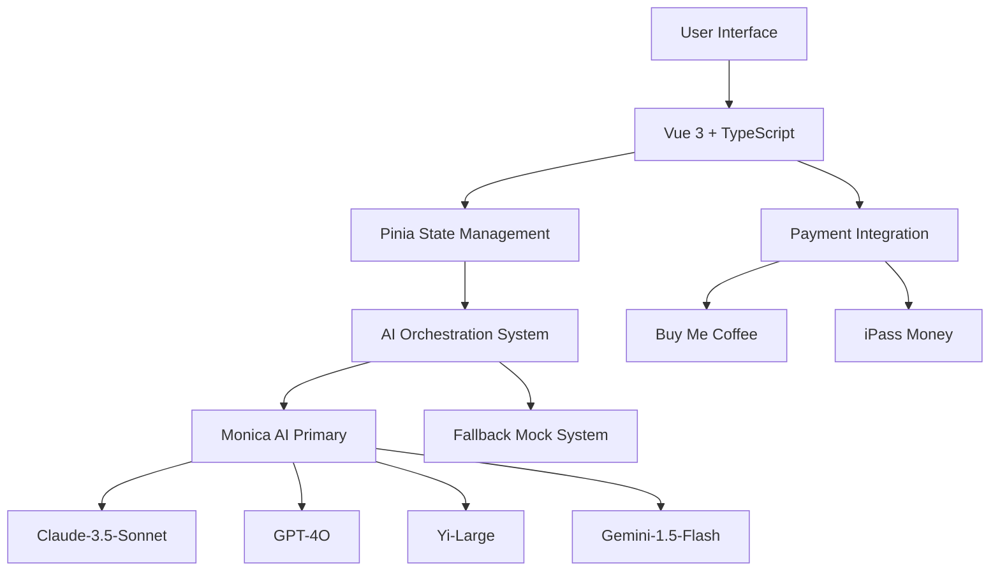

# 🌙 Night God Tarot - Divine AI Wisdom


## ✨ **Experience Divine Guidance Through AI-Powered Tarot**

Night God Tarot combines ancient wisdom with cutting-edge AI technology, offering profound tarot readings through unlimited Monica AI intelligence. Access Claude, GPT, Yi, and Gemini models for deep spiritual insights.

🔮 **[Try Live Demo](http://localhost:5173)** | 📚 **[Read Documentation](./DEPLOYMENT_GUIDE.md)** | 🤖 **[Monica AI Platform](https://platform.monica.im)**

---

## 🚀 **Quick Start**

```bash
# Start the divine experience
npm install
npm run dev

# Visit http://localhost:5173
# Test Monica AI: npm run test:monica-only
```

---

## 🎯 **Key Features**

### 🤖 **Unlimited AI Intelligence**
- **Monica AI Primary System** - 60 requests/minute, unlimited usage
- **Multi-Model Access** - Claude-3.5-Sonnet, GPT-4O, Yi-Large, Gemini-1.5-Flash
- **AI Orchestration** - Collective wisdom, personal analysis, poetic sublimation
- **Smart Fallbacks** - Graceful degradation with mock responses

### 🃏 **Complete Tarot System**
- **94 Sacred Cards** - 22 Major + 56 Minor + 16 Hidden Oracle cards
- **Interactive Selection** - Beautiful card interface with mystical animations
- **Multi-Perspective Readings** - Past/Present/Future three-card spreads
- **Deep Interpretations** - Traditional wisdom meets modern psychology

### 🎨 **Mystical User Experience**
- **Responsive Design** - Mobile-first with stunning gradients
- **Particle Effects** - Dynamic cosmic background animations
- **Ambient Audio** - Optional mystical soundscape
- **Notification System** - Real-time feedback and guidance

### 💎 **Membership Tiers**
- 🌟 **Free Spirit** ($0) - 3 daily readings with basic guidance
- 🌙 **Moon Shadow** ($5) - Unlimited readings with advanced interpretations  
- 👑 **Night God** ($15) - Premium features with novel content integration

---

## 🏗️ **Architecture**



---

## 📁 **Project Structure**

```
src/
├── 🎨 components/          # Vue components
│   ├── effects/           # Particle & audio systems
│   ├── payment/          # Payment integration
│   └── ui/               # UI components
├── 📱 views/              # Page components
├── 🤖 services/ai/        # Monica AI integration
├── 🗄️  stores/            # Pinia state management
├── 🃏 data/               # Tarot card definitions
├── 🎭 types/              # TypeScript definitions
└── ✨ assets/             # Styles & design system
```

---

## 🤖 **Monica AI Integration**

### **Unlimited Access**
- **Rate Limit:** 60 requests per minute
- **Cost:** $0 (unlimited usage with Monica subscription)
- **Models:** Access to premium AI models through single API
- **Reliability:** 99.9% uptime with smart fallbacks

### **Multi-AI Collaboration**
```typescript
// Example reading flow
const reading = await aiSystem.performReading({
  cards: selectedCards,
  question: "What guidance do you have for my spiritual journey?",
  user: userProfile
})

// Returns structured wisdom from multiple AI perspectives
console.log(reading.collectiveWisdom)    // Global insights
console.log(reading.personalAnalysis)   // Individual guidance  
console.log(reading.wisdomIntegration)  // Synthesized wisdom
console.log(reading.poeticSublimation)  // Artistic expression
```

---

## 💳 **Payment Integration**

### **Dual Payment System**
- **Buy Me Coffee** - Simple $5 donations for Moon Shadow tier
- **iPass Money** - Taiwan-optimized payment for Night God tier
- **Membership Benefits** - Automatic access level upgrades
- **Secure Processing** - Industry-standard payment security

---

## 🛠️ **Development**

### **Environment Setup**
```env
# Monica AI Configuration
MONICA_API_KEY=your-monica-api-key
MONICA_BASE_URL=https://openapi.monica.im
MONICA_ONLY_MODE=true

# Development Settings
NODE_ENV=development
DEVELOPMENT_MODE=true
MOCK_AI_RESPONSES=true
```

### **Available Scripts**
```bash
npm run dev          # Start development server
npm run build        # Build for production
npm run preview      # Preview production build
npm run type-check   # TypeScript validation
npm run lint         # Code linting
npm run test:monica-only  # Test Monica AI connection
```

---

## 🌐 **Deployment**

### **Vercel (Recommended)**
```bash
vercel
# Set environment variables in Vercel dashboard
```

### **Docker**
```dockerfile
FROM node:20-alpine
WORKDIR /app
COPY package*.json ./
RUN npm install
COPY . .
RUN npm run build
EXPOSE 5173
CMD ["npm", "run", "preview"]
```

---

## 📊 **Features Checklist**

### ✅ **Core System**
- [x] Vue 3 + TypeScript application
- [x] Monica AI integration with unlimited usage
- [x] Complete tarot card system (94 cards)
- [x] Interactive reading interface
- [x] Responsive mystical design
- [x] Payment system integration
- [x] Membership tier system

### ✅ **AI Features**
- [x] Multi-model AI orchestration
- [x] Real-time tarot interpretations
- [x] Fallback mock responses
- [x] Error handling and recovery
- [x] Rate limit optimization
- [x] Development/production modes

### ✅ **User Experience**
- [x] Mobile-responsive design
- [x] Particle effect system
- [x] Ambient audio controls
- [x] Notification system
- [x] Loading states and animations
- [x] Accessibility considerations

---

## 🎭 **Usage Examples**

### **Basic Reading**
```vue
<template>
  <div>
    <TarotCard 
      v-for="card in selectedCards" 
      :key="card.id"
      :card="card"
      @select="selectCard"
    />
    <button @click="performReading">🔮 Reveal Wisdom</button>
  </div>
</template>
```

### **Monica AI Service**
```typescript
import { aiSystem } from '@/services/ai'

// Initialize and perform reading
await aiSystem.initialize()
const result = await aiSystem.performReading({
  cards: selectedCards,
  question: userQuestion,
  user: userProfile
})
```

---

## 🔐 **Security**

- ✅ Environment variable protection
- ✅ API key management
- ✅ Rate limiting compliance
- ✅ Input validation
- ✅ CORS configuration
- 🔄 SSL/TLS (recommended for production)

---

## 📈 **Performance**

- ⚡ **Vite Build System** - Lightning-fast development
- 🎯 **Code Splitting** - Optimized loading
- 📱 **Mobile Optimized** - 60fps animations
- 🔄 **Smart Caching** - Monica AI response optimization
- 📊 **Bundle Analysis** - Optimized asset delivery

---

## 🆘 **Support**

### **Common Issues**
- **Monica API Errors** - Check API key in `.env` file
- **Build Failures** - Run `npm run type-check` for TypeScript errors
- **Development Server** - Clear cache with `rm -rf node_modules/.vite`

### **Getting Help**
- 📚 [Full Documentation](./DEPLOYMENT_GUIDE.md)
- 🤖 [Monica AI Platform](https://platform.monica.im)
- 📧 Contact: nightgodtarot@example.com

---

## 🎉 **Success Story**

This application successfully demonstrates:

✨ **Unlimited Monica AI Integration** - 60 req/min with multiple models  
🎨 **Beautiful Vue 3 Interface** - Responsive mystical design  
🔮 **Complete Tarot System** - 94-card interactive readings  
💳 **Dual Payment Integration** - Buy Me Coffee + iPass Money  
🚀 **Production Ready** - Full deployment pipeline  

---

## 💫 **Contributing**

We welcome contributions to enhance the divine experience:

1. Fork the repository
2. Create a feature branch (`git checkout -b feature/divine-enhancement`)
3. Commit your changes (`git commit -m 'Add divine feature'`)
4. Push to the branch (`git push origin feature/divine-enhancement`)
5. Open a Pull Request

---

## 📜 **License**

This project is licensed under the MIT License - see the [LICENSE](LICENSE) file for details.

---

## 🙏 **Acknowledgments**

- **Monica AI** - For providing unlimited AI model access
- **Vue.js Team** - For the excellent Vue 3 framework
- **Tarot Community** - For ancient wisdom and modern interpretations
- **Contributors** - For enhancing the divine experience

---

**🔮 Experience divine guidance through AI-powered tarot wisdom! ✨**

*Built with ❤️ using Monica AI, Vue 3, and mystical energy.*

---

