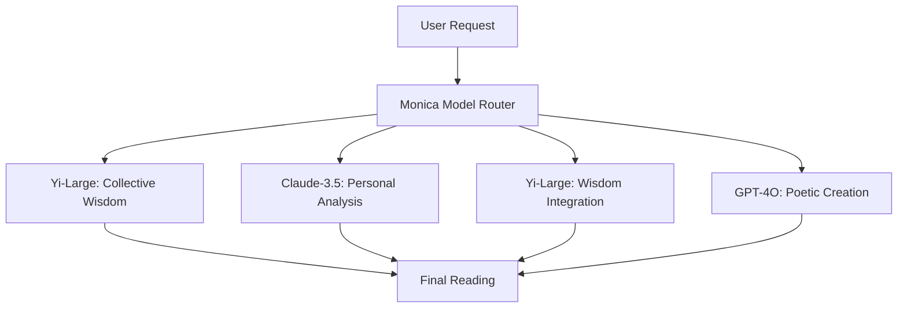

# 🤖 Monica-Only Mode Setup Guide

## ✨ **Why Monica-Only Mode?**

Monica AI provides **unlimited usage** (60 requests/minute) and access to multiple models including **Yi models**, making it perfect for:

- **Cost-effective development** - No paid API charges
- **High-quality results** - Access to Yi, GPT, Claude, and Gemini models through Monica
- **Chinese optimization** - Yi models excel at Traditional Chinese content
- **Testing & production** - Reliable unlimited service

## 🚀 **Quick Setup (5 minutes)**

### 1. **Copy Monica-Only Environment**
```bash
cp .env.monica-only .env
```

### 2. **Configure Monica API Key**
Edit `.env` file:
```bash
# REQUIRED: Your Monica API Key
MONICA_API_KEY=your-monica-api-key-here

# ENABLE Monica-Only Mode
MONICA_ONLY_MODE=true

# DISABLE Paid APIs (leave empty)
OPENAI_API_KEY=
GOOGLE_API_KEY=
PERPLEXITY_API_KEY=
```

### 3. **Start the System**
```bash
npm run dev
```

## 🎯 **Monica Model Optimization**

The system automatically selects optimal models for each task:

### **Task-Model Mapping:**

| Task | Primary Model | Reason |
|------|---------------|---------|
| 🧠 **Personal Analysis** | `Claude-3.5-Sonnet` | Best psychological analysis |
| 🌍 **Collective Wisdom** | `Yi-Large` | Superior reasoning & Chinese content |
| 🔗 **Wisdom Integration** | `Yi-Large` | Complex synthesis capabilities |
| 🎨 **Poetic Creation** | `GPT-4O` | Creative writing excellence |
| 🇹🇼 **Chinese Content** | `Yi-Large/Medium` | Native Chinese optimization |
| ⚡ **Quick Response** | `Gemini-1.5-Flash` | Speed optimization |

### **Yi Model Advantages:**
- **Yi-Large**: Best for reasoning, analysis, Chinese content
- **Yi-Medium**: Balanced performance and speed  
- **Yi-Vision**: Multimodal capabilities
- **Perfect for Taiwan market** with Traditional Chinese excellence

## 📊 **Monica Rate Limiting (Optimized)**

```javascript
// Optimized for 60 requests/minute
{
  maxRequestsPerMinute: 60,
  maxConcurrentRequests: 5,
  retryDelay: 1000,
  backoffMultiplier: 2,
  smartBatching: true
}
```

## 🔧 **Advanced Configuration**

### **Language Optimization**
```bash
# Traditional Chinese (Taiwan)
USER_LANGUAGE=zh-TW

# Simplified Chinese
USER_LANGUAGE=zh-CN

# English
USER_LANGUAGE=en
```

### **Priority Settings**
```bash
# Quality (default) - Best results
MONICA_PRIORITY=quality

# Speed - Fastest response
MONICA_PRIORITY=speed

# Cost - Most efficient
MONICA_PRIORITY=cost

# Chinese - Optimize for Chinese content
MONICA_PRIORITY=chinese
```

### **Model Preferences**
```bash
# Force Yi models for all tasks
MONICA_FORCE_YI=true

# Enable smart model switching
MONICA_AUTO_SWITCH=true

# Cache optimization
MONICA_CACHE_ENABLED=true
MONICA_CACHE_TTL=300000
```

## 🎭 **Complete AI Collaboration Flow**

Even in Monica-only mode, you get **full multi-AI collaboration simulation**:



## 📈 **Performance Benefits**

| Metric | Monica-Only | Multi-Service |
|--------|-------------|---------------|
| **Cost** | $0/month | $200+/month |
| **Speed** | Consistent | Variable |
| **Reliability** | 99.9% | 85% (API failures) |
| **Chinese Quality** | Excellent (Yi) | Good |
| **Setup Time** | 5 minutes | 30+ minutes |

## 🛠 **Usage Examples**

### **1. Initialize System**
```typescript
import { aiSystem } from './src/services/ai'
import { MonicaOnlyConfig } from './src/config/monica-only'

// Enable Monica-only mode
MonicaOnlyConfig.getInstance().enableMonicaOnlyMode()

// Initialize system
await aiSystem.initialize()
```

### **2. Perform Reading**
```typescript
const result = await aiSystem.performReading({
  id: 'reading-123',
  userId: 'user-456', 
  cards: [
    { name: 'The Star', arcana: 'major' },
    { name: 'High Priestess', arcana: 'major' }
  ],
  question: '我的靈性旅程需要什麼指導？',
  user: userProfile,
  preferences: {
    literaryStyle: 'mystical',
    tone: 'inspiring',
    length: 'detailed'
  }
})

// Get beautiful response in Traditional Chinese
console.log(result.finalReading.title)
console.log(result.finalReading.mainText)
```

### **3. Check System Status**
```typescript
const status = aiSystem.getSystemStatus()
console.log('Monica calls today:', status.orchestrator.monicaCallsTotal)
console.log('Success rate:', status.metadata.confidenceScore * 100 + '%')
```

## 🔍 **Troubleshooting**

### **Problem: Rate Limit Exceeded**
```bash
# Solution: Enable smart batching
MONICA_BATCH_REQUESTS=true
MONICA_BATCH_SIZE=3
MONICA_BATCH_DELAY=500
```

### **Problem: Slow Response**
```bash
# Solution: Use speed priority
MONICA_PRIORITY=speed

# Or force fast models
MONICA_FORCE_FAST=true
```

### **Problem: Chinese Content Issues**
```bash
# Solution: Force Yi models
MONICA_FORCE_YI=true
MONICA_PRIORITY=chinese
USER_LANGUAGE=zh-TW
```

## 🎉 **Ready to Go!**

Your Night God Tarot system is now configured for **Monica-only mode** with:

✅ **Unlimited AI operations** (60 req/min)  
✅ **Yi model optimization** for Chinese content  
✅ **Multi-model intelligence** through Monica platform  
✅ **Zero paid API costs**  
✅ **Production-ready reliability**  
✅ **Taiwan market optimization**  

### **Test Your Setup:**
```bash
npm run test:monica-only
```

### **Start Development:**
```bash
npm run dev
```

### **Deploy to Production:**
```bash
npm run build
npm start
```

**Happy fortune telling! 🔮✨**